# OpenManus Agent 执行模块深度分析

## 概述

OpenManus 的 Agent 执行模块采用了分层架构设计，实现了灵活、可扩展的 AI 代理系统。该模块支持多种代理类型、工具调用、状态管理和流程控制，为构建强大的 AI 助手提供了坚实的基础。

## 核心架构

### 架构层次图

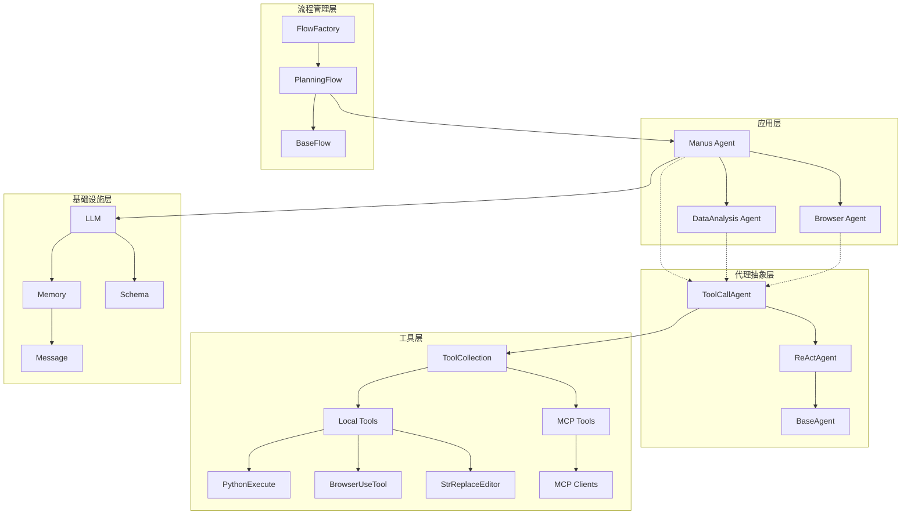

## 核心组件分析

### 1. BaseAgent - 基础代理类

<mcfile name="base.py" path="app/agent/base.py"></mcfile> 提供了所有代理的基础功能：

```python
class BaseAgent(BaseModel, ABC):
    """Abstract base class for managing agent state and execution."""

    # 核心属性
    name: str = Field(..., description="Unique name of the agent")
    description: Optional[str] = Field(None, description="Optional agent description")

    # 提示词
    system_prompt: Optional[str] = Field(None, description="System-level instruction prompt")
    next_step_prompt: Optional[str] = Field(None, description="Prompt for determining next action")

    # 依赖组件
    llm: LLM = Field(default_factory=LLM, description="Language model instance")
    memory: Memory = Field(default_factory=Memory, description="Agent's memory store")
    state: AgentState = Field(default=AgentState.IDLE, description="Current agent state")

    # 执行控制
    max_steps: int = Field(default=10, description="Maximum steps before termination")
    current_step: int = Field(default=0, description="Current step in execution")
```

#### 关键特性：

1. **状态管理**：通过 `AgentState` 枚举管理代理状态
2. **内存管理**：维护对话历史和上下文
3. **执行控制**：限制最大步数，防止无限循环
4. **防死循环机制**：检测重复响应并自动调整策略

#### 状态转换图

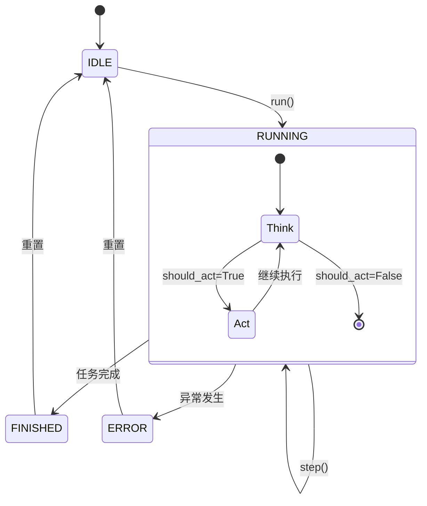

### 2. ReActAgent - 思考-行动模式

<mcfile name="react.py" path="app/agent/react.py"></mcfile> 实现了经典的 ReAct（Reasoning and Acting）模式：

```python
class ReActAgent(BaseAgent, ABC):
    @abstractmethod
    async def think(self) -> bool:
        """Process current state and decide next action"""

    @abstractmethod
    async def act(self) -> str:
        """Execute decided actions"""

    async def step(self) -> str:
        """Execute a single step: think and act."""
        should_act = await self.think()
        if not should_act:
            return "Thinking complete - no action needed"
        return await self.act()
```

#### Think-Act 循环时序图

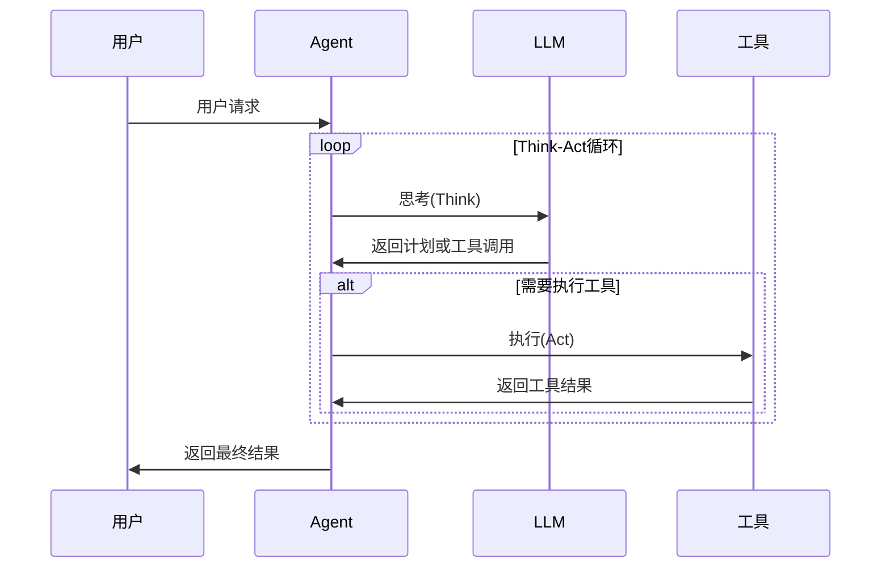

### 3. ToolCallAgent - 工具调用代理

<mcfile name="toolcall.py" path="app/agent/toolcall.py"></mcfile> 扩展了工具调用能力：

```python
class ToolCallAgent(ReActAgent):
    """Base agent class for handling tool/function calls"""

    available_tools: ToolCollection = ToolCollection(CreateChatCompletion(), Terminate())
    tool_choices: TOOL_CHOICE_TYPE = ToolChoice.AUTO
    special_tool_names: List[str] = Field(default_factory=lambda: [Terminate().name])

    async def think(self) -> bool:
        """Process current state and decide next actions using tools"""
        # 获取 LLM 响应和工具调用
        response = await self.llm.ask_tool(
            messages=self.messages,
            system_msgs=([Message.system_message(self.system_prompt)] if self.system_prompt else None),
            tools=self.available_tools.to_params(),
            tool_choice=self.tool_choices,
        )

        self.tool_calls = response.tool_calls if response and response.tool_calls else []
        # ... 处理响应和工具调用逻辑

    async def act(self) -> str:
        """Execute tool calls and handle their results"""
        results = []
        for command in self.tool_calls:
            result = await self.execute_tool(command)
            # 添加工具响应到内存
            tool_msg = Message.tool_message(
                content=result,
                tool_call_id=command.id,
                name=command.function.name,
            )
            self.memory.add_message(tool_msg)
            results.append(result)
        return "\n\n".join(results)
```

#### 工具选择模式

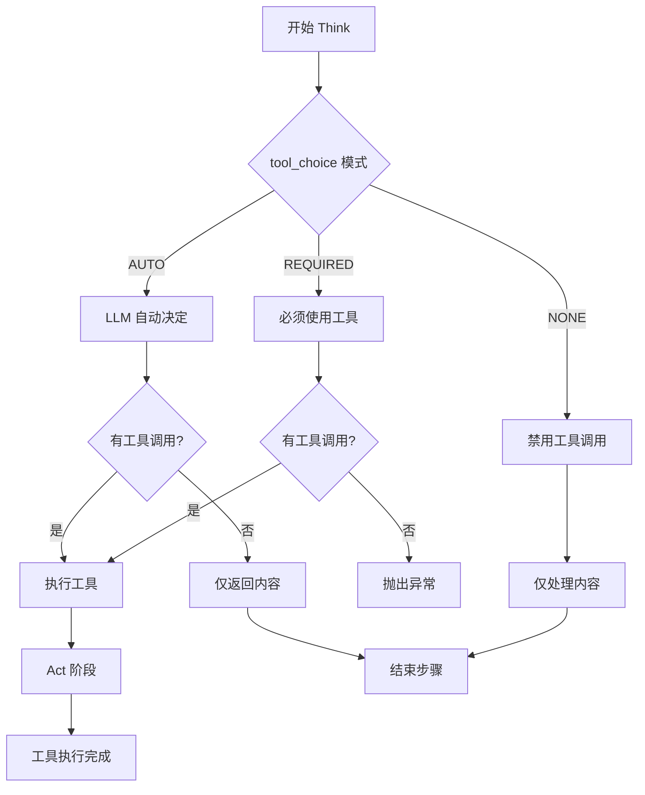

### 4. Manus - 主要代理实现

<mcfile name="manus.py" path="app/agent/manus.py"></mcfile> 是项目的核心代理，集成了多种能力：

```python
class Manus(ToolCallAgent):
    """A versatile general-purpose agent with support for both local and MCP tools."""

    name: str = "Manus"
    description: str = "A versatile agent that can solve various tasks using multiple tools including MCP-based tools"

    # 工具集合
    available_tools: ToolCollection = Field(
        default_factory=lambda: ToolCollection(
            PythonExecute(),
            BrowserUseTool(),
            StrReplaceEditor(),
            AskHuman(),
            Terminate(),
        )
    )

    # MCP 客户端支持
    mcp_clients: MCPClients = Field(default_factory=MCPClients)
    browser_context_helper: Optional[BrowserContextHelper] = None
```

#### Manus 能力图谱

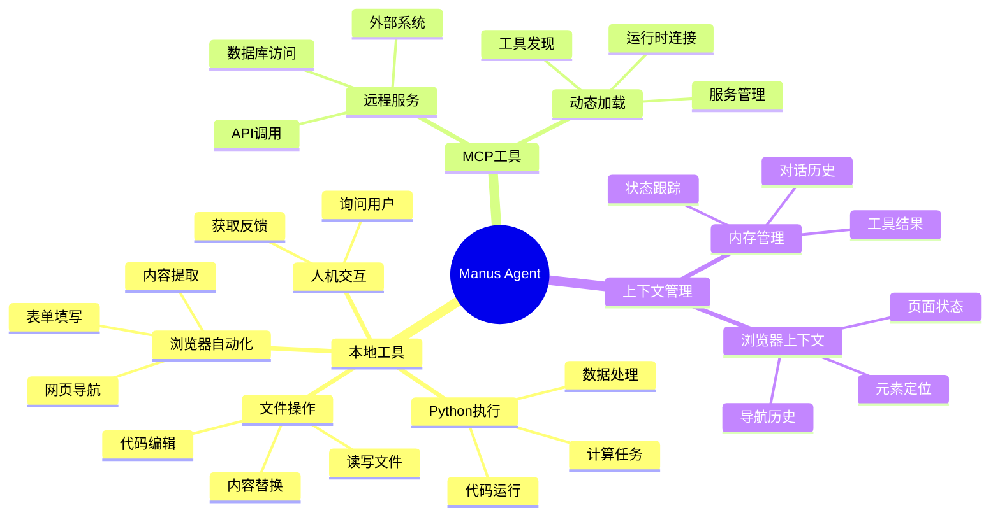

## 执行流程详解

### 代理初始化流程

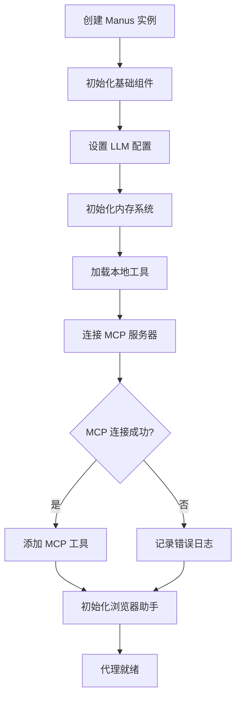

### 工具执行流程

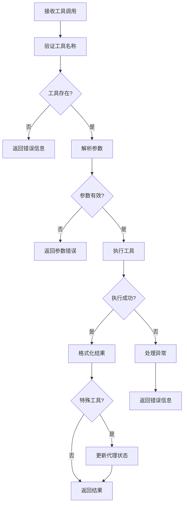

## 内存管理系统

### 消息类型和结构

```python
class Message(BaseModel):
    """Represents a chat message with role, content, and optional metadata."""

    role: Role  # user, assistant, system, tool
    content: str
    tool_calls: Optional[List[ToolCall]] = None
    tool_call_id: Optional[str] = None
    name: Optional[str] = None
    base64_image: Optional[str] = None
```

### 内存管理流程

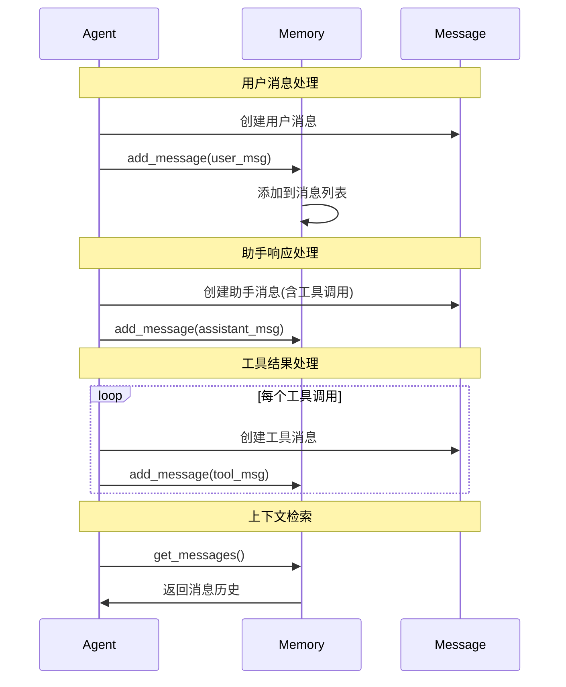

## 流程管理系统

### PlanningFlow 架构

<mcfile name="planning.py" path="app/flow/planning.py"></mcfile> 实现了复杂任务的规划和执行：

```python
class PlanningFlow(BaseFlow):
    """A flow that manages planning and execution of tasks using agents."""

    llm: LLM = Field(default_factory=lambda: LLM())
    planning_tool: PlanningTool = Field(default_factory=PlanningTool)
    executor_keys: List[str] = Field(default_factory=list)
    active_plan_id: str = Field(default_factory=lambda: f"plan_{int(time.time())}")
    current_step_index: Optional[int] = None
```

### 计划执行流程

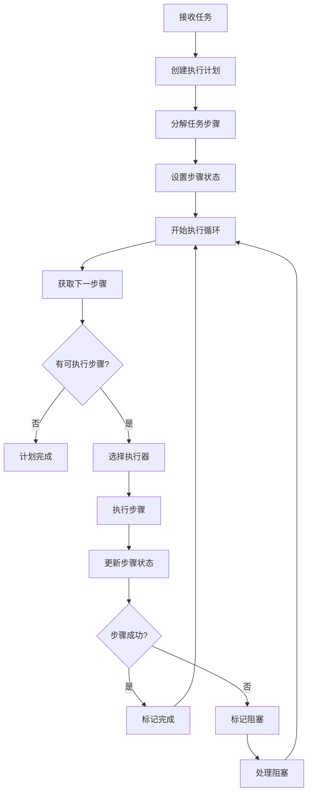

### 步骤状态管理

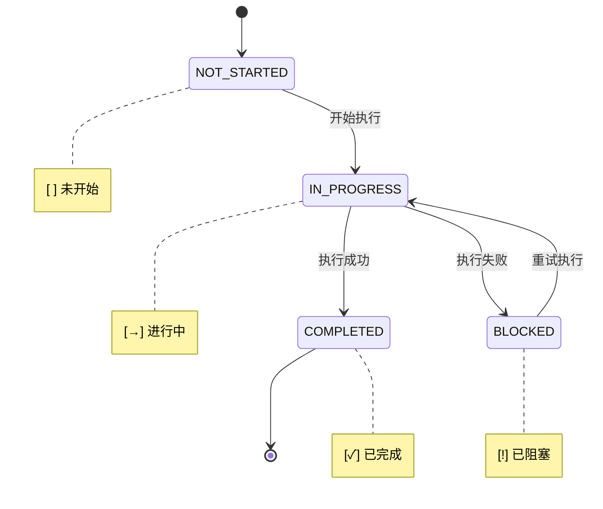

## 错误处理和恢复机制

### 异常处理层次

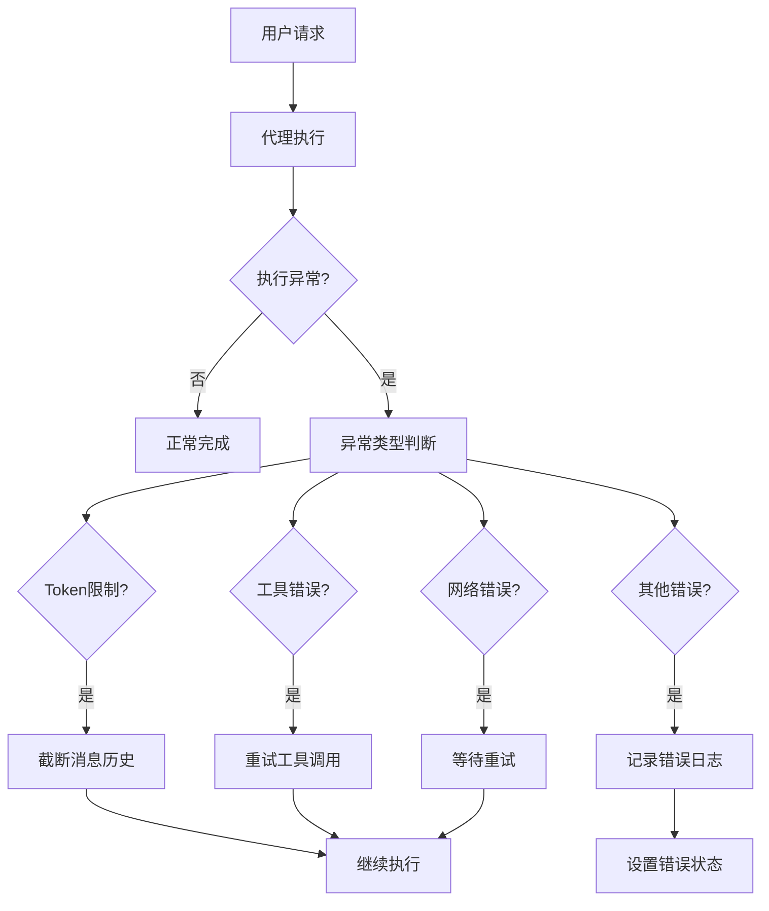

### 防死循环机制

```python
def is_stuck(self) -> bool:
    """Check if the agent is stuck in a loop by detecting duplicate content"""
    if len(self.memory.messages) < 2:
        return False

    last_message = self.memory.messages[-1]
    if not last_message.content:
        return False

    # Count identical content occurrences
    duplicate_count = sum(
        1 for msg in reversed(self.memory.messages[:-1])
        if msg.role == "assistant" and msg.content == last_message.content
    )

    return duplicate_count >= self.duplicate_threshold

def handle_stuck_state(self):
    """Handle stuck state by adding a prompt to change strategy"""
    stuck_prompt = "Observed duplicate responses. Consider new strategies and avoid repeating ineffective paths already attempted."
    self.next_step_prompt = f"{stuck_prompt}\n{self.next_step_prompt}"
    logger.warning(f"Agent detected stuck state. Added prompt: {stuck_prompt}")
```

## 性能优化和扩展性

### 工具管理优化

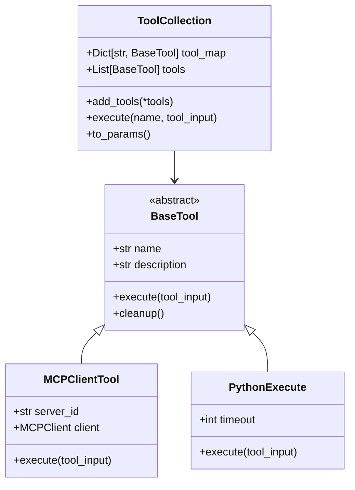

### 内存优化策略

1. **消息截断**：当达到 token 限制时自动截断历史消息
2. **上下文压缩**：保留关键信息，压缩冗余内容
3. **分层存储**：重要消息持久化，临时消息内存存储

### 扩展点设计

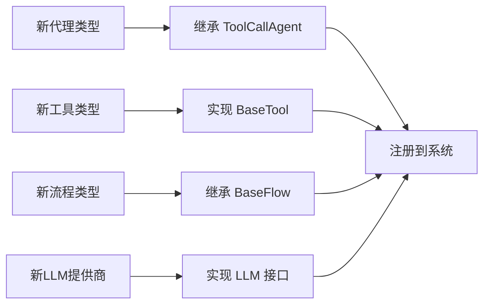

## 最佳实践和建议

### 1. 代理设计原则

- **单一职责**：每个代理专注于特定领域
- **组合优于继承**：通过工具组合实现功能
- **状态隔离**：避免代理间状态污染
- **资源管理**：及时清理资源，防止泄漏

### 2. 工具开发指南

```python
class CustomTool(BaseTool):
    name: str = "custom_tool"
    description: str = "A custom tool for specific tasks"

    async def execute(self, tool_input: Dict[str, Any]) -> str:
        """执行工具逻辑"""
        try:
            # 1. 验证输入参数
            self._validate_input(tool_input)

            # 2. 执行核心逻辑
            result = await self._core_logic(tool_input)

            # 3. 格式化输出
            return self._format_output(result)

        except Exception as e:
            logger.error(f"Tool {self.name} failed: {e}")
            return f"Error: {str(e)}"

    async def cleanup(self):
        """清理资源"""
        # 释放连接、文件句柄等
        pass
```

### 3. 错误处理策略

- **分层异常处理**：在不同层次捕获和处理异常
- **优雅降级**：当某些功能不可用时提供替代方案
- **重试机制**：对临时性错误实施指数退避重试
- **状态恢复**：异常后能够恢复到一致状态

## 总结

OpenManus 的 Agent 执行模块展现了优秀的软件架构设计，具有以下核心优势：

1. **分层清晰**：从基础代理到具体实现，每层职责明确
2. **扩展性强**：支持新代理类型、工具和流程的轻松添加
3. **状态安全**：完善的状态管理和转换机制
4. **工具生态**：丰富的本地工具和 MCP 协议支持
5. **错误恢复**：多层次的异常处理和恢复机制
6. **性能优化**：内存管理、防死循环等优化策略

这个架构为构建强大、可靠的 AI Agent 系统提供了坚实的基础，是现代 AI 应用开发的优秀范例。
