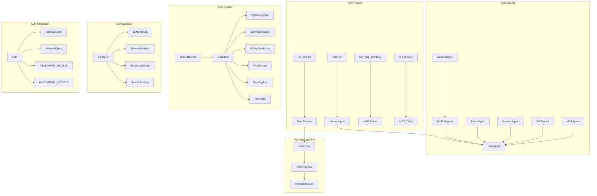
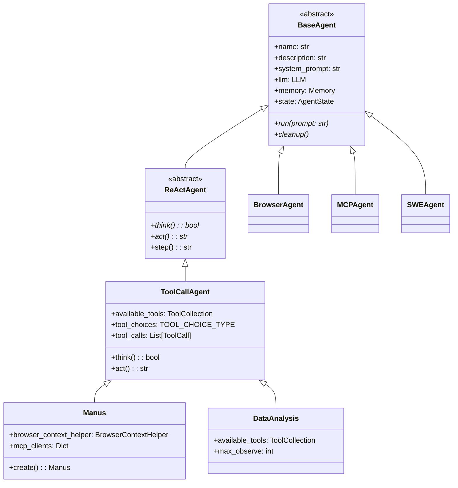
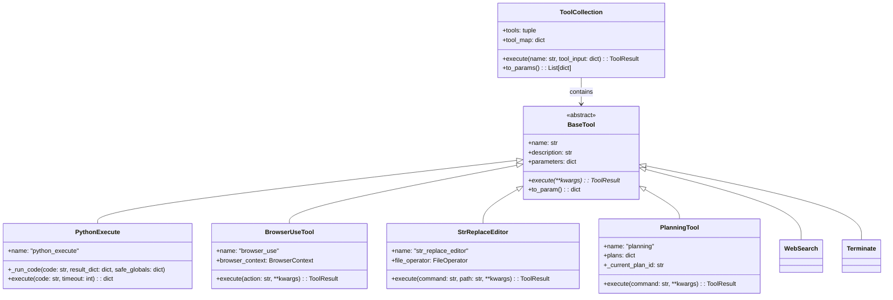
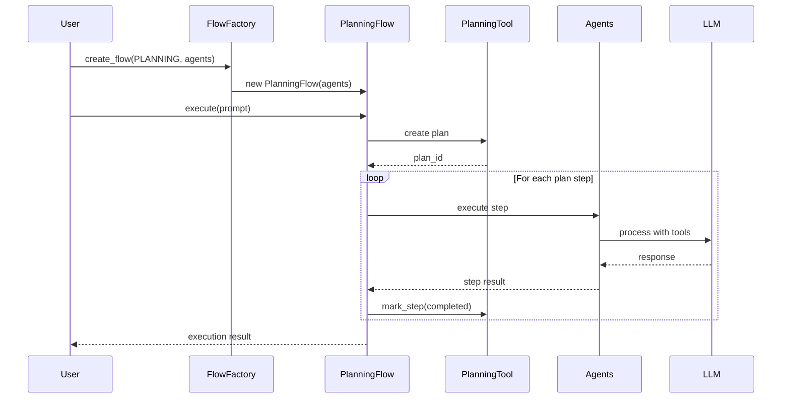
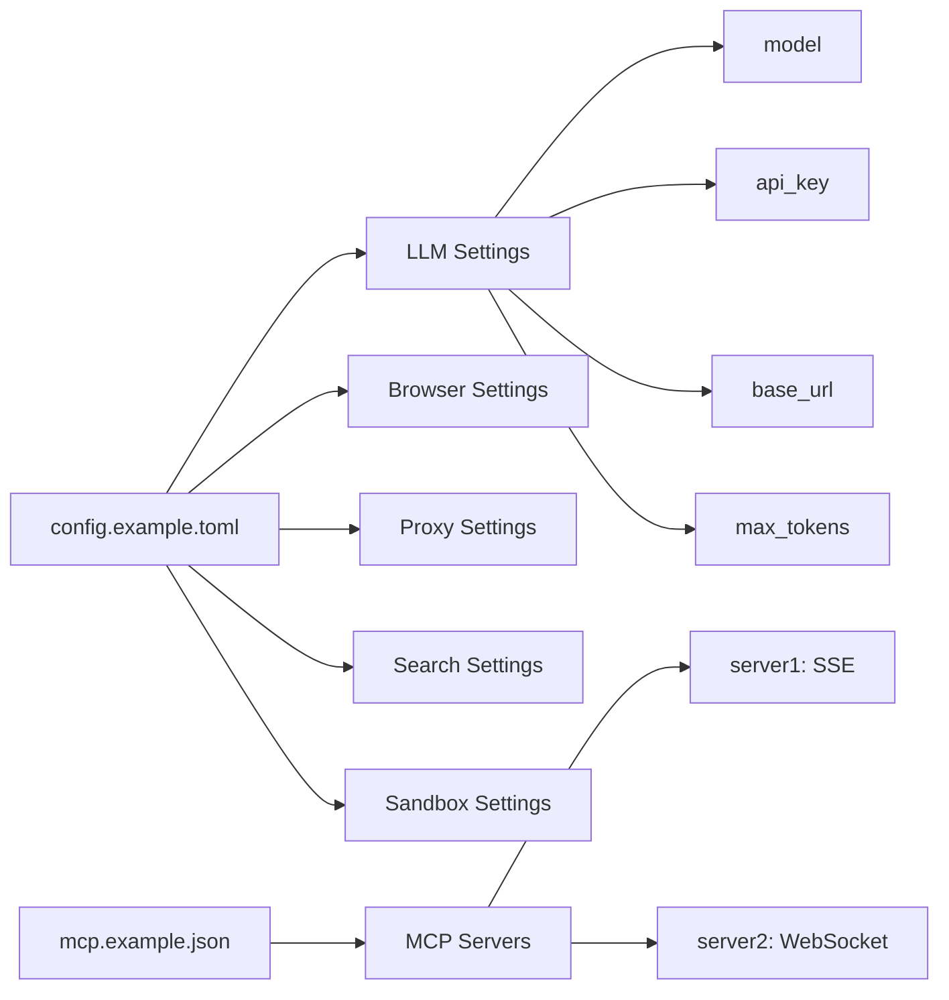
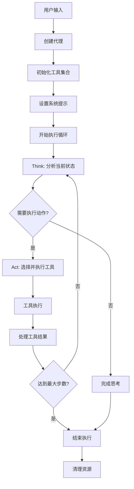
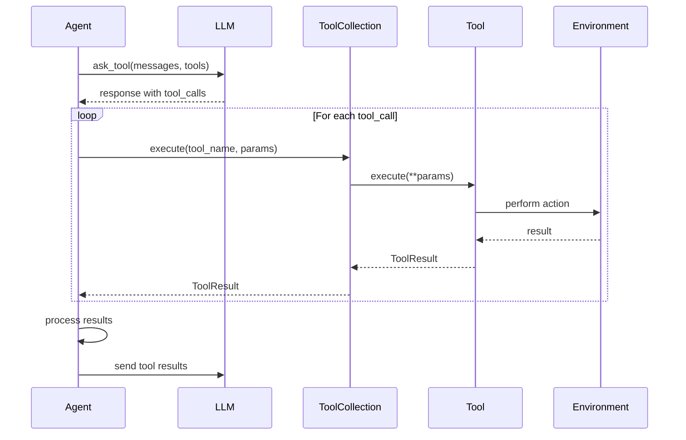
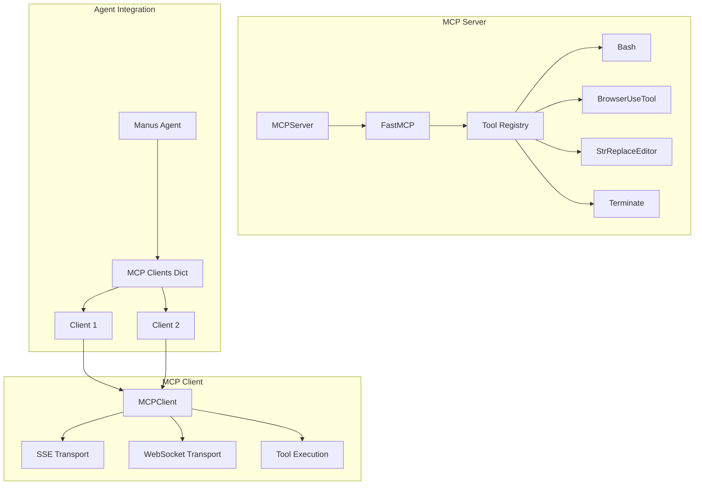
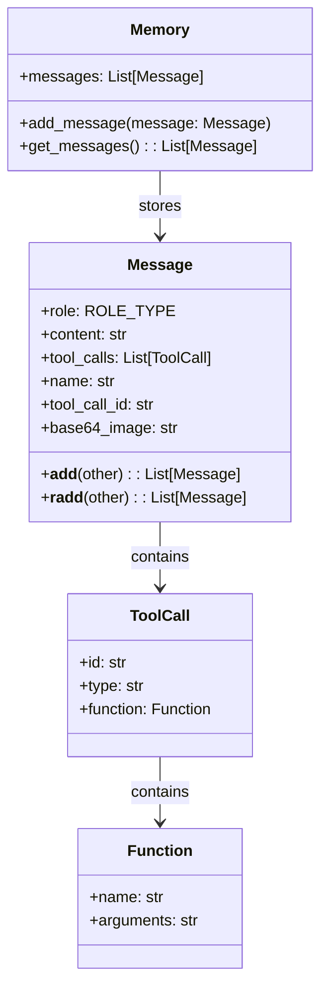
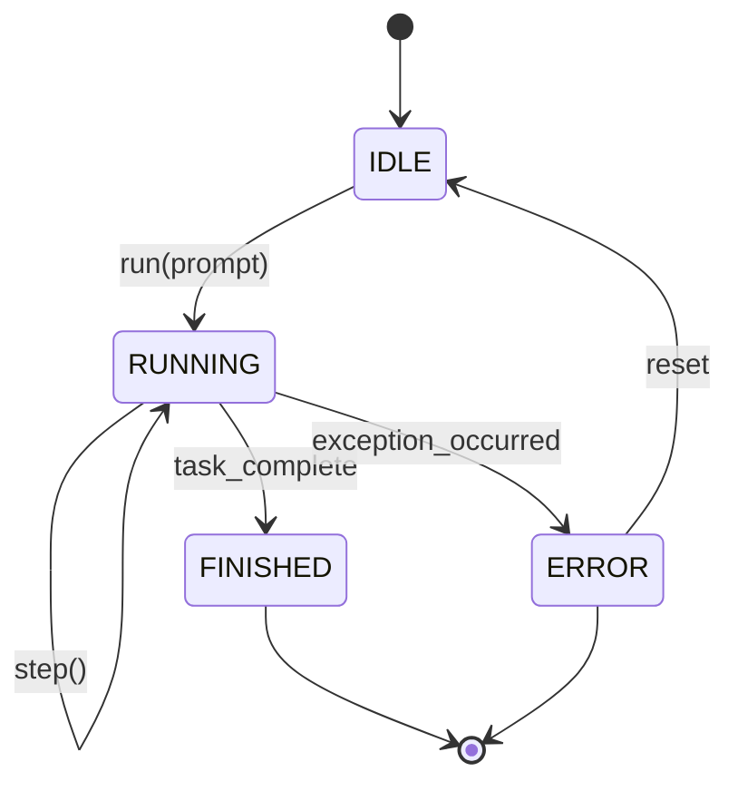

# OpenManus 项目结构分析文档

## 项目概览

OpenManus 是一个多功能的 AI 代理框架，旨在通过各种工具解决复杂任务。该项目支持多语言、提供多种代理类型，并集成了浏览器自动化、代码执行、文件操作等功能。

### 核心特性
- 🤖 多种代理类型（Manus、DataAnalysis、ToolCall、ReAct等）
- 🛠️ 丰富的工具集合（Python执行、浏览器操作、文件编辑等）
- 🔄 支持 MCP (Model Context Protocol) 服务器
- 📊 数据分析和可视化能力
- 🌐 Web 搜索和浏览器自动化
- 📝 规划和任务管理

## 项目架构概览



## 目录结构详解

### `/app/` - 核心应用模块

#### 代理模块 (`/app/agent/`)

```python
# app/agent/base.py - 基础代理抽象类
class BaseAgent(ABC):
    """所有代理的基础抽象类"""
    name: str
    description: Optional[str] = None
    system_prompt: Optional[str] = None
    llm: Optional[LLM] = Field(default_factory=LLM)
    memory: Memory = Field(default_factory=Memory)
    state: AgentState = AgentState.IDLE
    max_steps: int = 10
    current_step: int = 0
```

**代理继承层次结构：**



#### 工具模块 (`/app/tool/`)

**工具系统架构：**



**核心工具实现示例：**

```python
# app/tool/python_execute.py
class PythonExecute(BaseTool):
    """Python代码执行工具，支持超时和安全限制"""
    name: str = "python_execute"
    description: str = "执行Python代码字符串，只有print输出可见"
    
    async def execute(self, code: str, timeout: int = 5) -> Dict:
        """在安全环境中执行Python代码"""
        safe_globals = {
            "__builtins__": {
                "print": print,
                "len": len,
                "range": range,
                # ... 其他安全的内置函数
            }
        }
        # 执行代码并捕获输出
```

#### 流程管理 (`/app/flow/`)

**流程执行时序图：**



#### LLM 集成 (`/app/llm.py`)

```python
# app/llm.py - LLM核心类
class LLM:
    """大型语言模型交互类"""
    
    def __init__(self):
        self.settings = config.llm_config
        self.token_counter = TokenCounter()
        self.bedrock_client = BedrockClient() if self.settings.api_type == "aws" else None
    
    async def ask_tool(self, messages: List[Message], **kwargs) -> Message:
        """请求LLM进行工具调用"""
        
    async def ask(self, messages: List[Message], **kwargs) -> Message:
        """标准LLM请求"""
```

### `/config/` - 配置文件

**配置结构：**



### 主要入口点分析

#### `main.py` - 单代理模式

```python
# main.py - Manus代理直接执行
async def main():
    parser = argparse.ArgumentParser(description="Run Manus agent with a prompt")
    parser.add_argument("--prompt", type=str, required=False)
    args = parser.parse_args()
    
    agent = await Manus.create()  # 创建Manus代理
    try:
        prompt = args.prompt if args.prompt else input("Enter your prompt: ")
        await agent.run(prompt)  # 执行任务
    finally:
        await agent.cleanup()  # 清理资源
```

#### `run_flow.py` - 多代理流程模式

```python
# run_flow.py - 使用Flow管理多个代理
async def run_flow():
    agents = {
        "manus": Manus(),
    }
    if config.run_flow_config.use_data_analysis_agent:
        agents["data_analysis"] = DataAnalysis()
    
    flow = FlowFactory.create_flow(
        flow_type=FlowType.PLANNING,
        agents=agents,
    )
    
    result = await asyncio.wait_for(
        flow.execute(prompt),
        timeout=3600  # 1小时超时
    )
```

## 核心工作流程

### 1. 代理执行流程



### 2. 工具调用流程



### 3. MCP 服务器架构



## 数据流和状态管理

### 消息流结构



### 代理状态转换



## 配置系统详解

### 配置类层次结构

```python
# app/config.py - 配置类定义
class LLMSettings(BaseModel):
    """LLM相关配置"""
    model: str = "claude-3-7-sonnet-20250219"
    base_url: str = "https://api.anthropic.com/v1/"
    api_key: str
    max_tokens: int = 8192
    temperature: float = 0.0
    api_type: str = "anthropic"

class BrowserSettings(BaseModel):
    """浏览器相关配置"""
    headless: bool = True
    disable_security: bool = True
    window_width: int = 1280
    window_height: int = 720

class SandboxSettings(BaseModel):
    """沙盒环境配置"""
    enabled: bool = False
    image: str = "python:3.12-slim"
    memory_limit: str = "512m"
    timeout: int = 300
```

## 扩展性和插件系统

### 工具扩展机制

```python
# 自定义工具示例
class CustomTool(BaseTool):
    name: str = "custom_tool"
    description: str = "自定义工具描述"
    parameters: dict = {
        "type": "object",
        "properties": {
            "param1": {"type": "string", "description": "参数1"}
        },
        "required": ["param1"]
    }
    
    async def execute(self, param1: str) -> ToolResult:
        # 实现工具逻辑
        return ToolResult(content=f"处理结果: {param1}")

# 添加到代理
agent.available_tools = ToolCollection(
    agent.available_tools.tools + (CustomTool(),)
)
```

### MCP 扩展

```python
# MCP服务器扩展
class CustomMCPServer(MCPServer):
    def __init__(self):
        super().__init__()
        # 注册自定义工具
        self.server.register_tool("custom_mcp_tool", self.custom_tool)
    
    async def custom_tool(self, param: str) -> str:
        return f"MCP工具处理: {param}"
```

## 性能优化和监控

### Token 计数和优化

```python
# app/llm.py - Token计数器
class TokenCounter:
    """Token使用统计"""
    
    def __init__(self):
        self.total_input_tokens = 0
        self.total_output_tokens = 0
        self.total_cost = 0.0
    
    def count_tokens(self, text: str, model: str) -> int:
        """计算文本的token数量"""
        # 使用tiktoken或其他tokenizer
        
    def add_usage(self, input_tokens: int, output_tokens: int, model: str):
        """添加使用统计"""
        self.total_input_tokens += input_tokens
        self.total_output_tokens += output_tokens
        self.total_cost += self.calculate_cost(input_tokens, output_tokens, model)
```

## 安全性考虑

### 代码执行安全

```python
# app/tool/python_execute.py - 安全执行环境
def create_safe_globals():
    """创建安全的全局环境"""
    return {
        "__builtins__": {
            # 只允许安全的内置函数
            "print": print,
            "len": len,
            "range": range,
            "str": str,
            "int": int,
            "float": float,
            # 禁止危险函数如 exec, eval, open, import
        }
    }
```

### 沙盒隔离

```python
# app/sandbox/client.py - 沙盒客户端
class BaseSandboxClient(ABC):
    """沙盒客户端基类"""
    
    @abstractmethod
    async def copy_from_container(self, container_path: str, host_path: str):
        """从容器复制文件到主机"""
    
    @abstractmethod
    async def copy_to_container(self, host_path: str, container_path: str):
        """从主机复制文件到容器"""
```

## 总结

OpenManus 是一个设计良好的多代理 AI 框架，具有以下优势：

1. **模块化设计**：清晰的代理、工具、流程分离
2. **可扩展性**：支持自定义工具和代理类型
3. **多协议支持**：集成 MCP 协议，支持分布式工具调用
4. **安全性**：沙盒执行环境和安全限制
5. **灵活配置**：支持多种 LLM 提供商和配置选项
6. **丰富工具集**：内置浏览器自动化、代码执行、文件操作等工具

该框架适合构建复杂的 AI 应用，特别是需要多步骤推理、工具调用和任务规划的场景。通过其模块化架构，开发者可以轻松扩展功能并集成新的工具和服务。